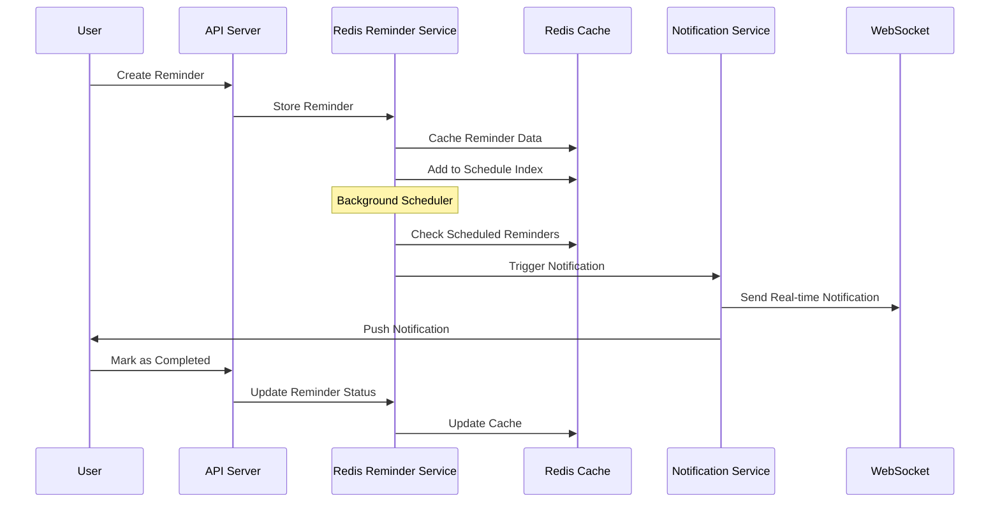
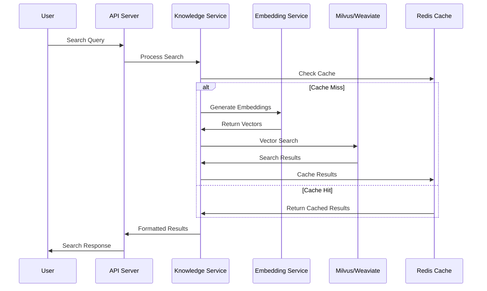

# Redis রিমাইন্ডার ও Milvus/Weaviate নলেজ সার্চ আর্কিটেকচার

## ১. সিস্টেম ওভারভিউ

### ১.১ আর্কিটেকচার সংক্ষিপ্তসার
ডা. মিমু মেডিকেল অ্যাপ্লিকেশনের জন্য একটি উন্নত আর্কিটেকচার যেখানে:
- **Redis**: রিমাইন্ডার সিস্টেম, স্কিডিউলিং এবং রিয়েল-টাইম নোটিফিকেশন
- **Milvus/Weaviate**: মেডিকেল নলেজ সার্চ, সিমান্টিক সার্চ এবং ভেক্টর ডেটাবেস

### ১.২ মূল উদ্দেশ্য
- রিয়েল-টাইম রিমাইন্ডার ডেলিভারি
- উচ্চ-পারফরমেন্স মেডিকেল নলেজ সার্চ
- স্কেলেবল এবং নির্ভরযোগ্য সিস্টেম
- বাংলা ভাষায় মেডিকেল কনটেক্সট সাপোর্ট

## ২. Redis রিমাইন্ডার সিস্টেম আর্কিটেকচার

### ২.১ Redis ডেটা স্ট্রাকচার

#### রিমাইন্ডার স্টোরেজ
```redis
# রিমাইন্ডার ডেটা
HSET reminder:{id} 
  type "medicine|appointment|test|followup"
  title "ওষুধ সেবনের সময়"
  description "প্যারাসিটামল ৫০০mg - খাবারের পরে"
  userId "user123"
  scheduledTime "2024-01-15T09:00:00Z"
  isRecurring "true"
  recurringPattern "{\"frequency\":\"daily\",\"interval\":1}"
  isActive "true"
  createdAt "2024-01-10T10:00:00Z"

# স্কিডিউল ইনডেক্স (Sorted Set)
ZADD reminder:schedule {timestamp} {reminder_id}

# ইউজার রিমাইন্ডার ইনডেক্স
SADD user:{userId}:reminders {reminder_id}

# টাইপ-ভিত্তিক ইনডেক্স
SADD reminder:type:{type} {reminder_id}
```

#### নোটিফিকেশন কিউ
```redis
# পেন্ডিং নোটিফিকেশন
LPUSH notification:queue "{\"reminderId\":\"{id}\",\"userId\":\"{userId}\",\"type\":\"reminder\",\"timestamp\":\"{time}\"}"

# প্রসেসিং নোটিফিকেশন
LPUSH notification:processing "{notification_data}"

# ফেইল্ড নোটিফিকেশন
LPUSH notification:failed "{notification_data}"
```

### ২.২ রিমাইন্ডার সার্ভিস কম্পোনেন্ট

#### RedisReminderService ক্লাস
```typescript
export class RedisReminderService {
  private redisClient: Redis;
  private scheduler: ReminderScheduler;
  private notificationService: NotificationService;
  
  // রিমাইন্ডার তৈরি
  async createReminder(reminder: ReminderData): Promise<string>
  
  // রিমাইন্ডার স্কিডিউল
  async scheduleReminder(reminderId: string): Promise<void>
  
  // রিকারিং রিমাইন্ডার হ্যান্ডল
  async handleRecurringReminder(reminderId: string): Promise<void>
  
  // নোটিফিকেশন ট্রিগার
  async triggerNotification(reminderId: string): Promise<void>
}
```

#### ReminderScheduler ক্লাস
```typescript
export class ReminderScheduler {
  private redisClient: Redis;
  private workerPool: Worker[];
  
  // স্কিডিউল চেকার (প্রতি মিনিটে)
  async checkScheduledReminders(): Promise<void>
  
  // ব্যাচ প্রসেসিং
  async processBatchReminders(reminders: string[]): Promise<void>
  
  // ডেড লেটার কিউ হ্যান্ডলিং
  async handleFailedReminders(): Promise<void>
}
```

### ২.৩ নোটিফিকেশন সিস্টেম

#### মাল্টি-চ্যানেল নোটিফিকেশন
```typescript
export interface NotificationChannel {
  type: 'push' | 'sms' | 'email' | 'websocket';
  priority: 'high' | 'medium' | 'low';
  retryCount: number;
  maxRetries: number;
}

export class NotificationService {
  // পুশ নোটিফিকেশন
  async sendPushNotification(userId: string, data: NotificationData): Promise<boolean>
  
  // SMS নোটিফিকেশন
  async sendSMSNotification(phone: string, message: string): Promise<boolean>
  
  // ইমেইল নোটিফিকেশন
  async sendEmailNotification(email: string, data: EmailData): Promise<boolean>
  
  // WebSocket রিয়েল-টাইম
  async sendWebSocketNotification(userId: string, data: any): Promise<boolean>
}
```

## ৩. Milvus/Weaviate নলেজ সার্চ সিস্টেম

### ৩.১ ভেক্টর ডেটাবেস আর্কিটেকচার

#### Milvus কনফিগারেশন
```yaml
# milvus.yaml
server:
  address: 0.0.0.0
  port: 19530

storage:
  path: /var/lib/milvus
  
collections:
  medical_knowledge:
    dimension: 1536  # OpenAI embedding dimension
    metric_type: "COSINE"
    index_type: "IVF_FLAT"
    nlist: 1024
```

#### Weaviate স্কিমা
```json
{
  "class": "MedicalKnowledge",
  "description": "বাংলা মেডিকেল নলেজ বেস",
  "vectorizer": "text2vec-openai",
  "properties": [
    {
      "name": "content",
      "dataType": ["text"],
      "description": "মেডিকেল কনটেন্ট"
    },
    {
      "name": "category",
      "dataType": ["string"],
      "description": "ক্যাটেগরি (রোগ, ওষুধ, চিকিৎসা)"
    },
    {
      "name": "language",
      "dataType": ["string"],
      "description": "ভাষা (bn, en)"
    },
    {
      "name": "severity",
      "dataType": ["string"],
      "description": "গুরুত্ব (low, medium, high, critical)"
    },
    {
      "name": "symptoms",
      "dataType": ["string[]"],
      "description": "লক্ষণসমূহ"
    },
    {
      "name": "treatments",
      "dataType": ["string[]"],
      "description": "চিকিৎসা পদ্ধতি"
    }
  ]
}
```

### ৩.২ নলেজ সার্চ সার্ভিস

#### MedicalKnowledgeService ক্লাস
```typescript
export class MedicalKnowledgeService {
  private milvusClient: MilvusClient;
  private weaviateClient: WeaviateClient;
  private embeddingService: OpenAIEmbeddings;
  
  // সিমান্টিক সার্চ
  async semanticSearch(query: string, options: SearchOptions): Promise<SearchResult[]>
  
  // হাইব্রিড সার্চ (কীওয়ার্ড + ভেক্টর)
  async hybridSearch(query: string, filters: SearchFilters): Promise<SearchResult[]>
  
  // লক্ষণ-ভিত্তিক সার্চ
  async symptomBasedSearch(symptoms: string[]): Promise<DiagnosisResult[]>
  
  // ওষুধ ইন্টারঅ্যাকশন চেক
  async checkDrugInteractions(medicines: string[]): Promise<InteractionResult[]>
}
```

#### SearchOptions ইন্টারফেস
```typescript
export interface SearchOptions {
  language: 'bn' | 'en' | 'both';
  category?: 'disease' | 'medicine' | 'treatment' | 'symptom';
  severity?: 'low' | 'medium' | 'high' | 'critical';
  limit: number;
  threshold: number;
  includeMetadata: boolean;
}

export interface SearchResult {
  id: string;
  content: string;
  score: number;
  category: string;
  metadata: {
    symptoms?: string[];
    treatments?: string[];
    medicines?: string[];
    severity?: string;
    language: string;
  };
}
```

## ৪. API এন্ডপয়েন্ট এবং ডেটা ফ্লো

### ৪.১ রিমাইন্ডার API

#### POST /api/reminders
```typescript
// রিমাইন্ডার তৈরি
interface CreateReminderRequest {
  type: 'medicine' | 'appointment' | 'test' | 'followup';
  title: string;
  description: string;
  scheduledTime: string; // ISO 8601
  isRecurring: boolean;
  recurringPattern?: {
    frequency: 'daily' | 'weekly' | 'monthly';
    interval: number;
    endDate?: string;
  };
  medicineInfo?: {
    name: string;
    dosage: string;
    instructions: string;
  };
}

interface CreateReminderResponse {
  success: boolean;
  reminderId: string;
  scheduledTime: string;
  nextOccurrence?: string;
}
```

#### GET /api/reminders
```typescript
// রিমাইন্ডার তালিকা
interface GetRemindersQuery {
  userId?: string;
  type?: string;
  isActive?: boolean;
  startDate?: string;
  endDate?: string;
  limit?: number;
  offset?: number;
}

interface GetRemindersResponse {
  success: boolean;
  reminders: ReminderData[];
  total: number;
  hasMore: boolean;
}
```

#### PUT /api/reminders/:id
```typescript
// রিমাইন্ডার আপডেট
interface UpdateReminderRequest {
  title?: string;
  description?: string;
  scheduledTime?: string;
  isActive?: boolean;
  isCompleted?: boolean;
}
```

#### POST /api/reminders/:id/snooze
```typescript
// রিমাইন্ডার স্নুজ
interface SnoozeReminderRequest {
  duration: number; // minutes
}
```

### ৪.২ নলেজ সার্চ API

#### POST /api/knowledge/search
```typescript
// নলেজ সার্চ
interface KnowledgeSearchRequest {
  query: string;
  language?: 'bn' | 'en' | 'both';
  category?: string;
  severity?: string;
  limit?: number;
  threshold?: number;
}

interface KnowledgeSearchResponse {
  success: boolean;
  results: SearchResult[];
  totalFound: number;
  searchTime: number;
  suggestions?: string[];
}
```

#### POST /api/knowledge/symptom-analysis
```typescript
// লক্ষণ বিশ্লেষণ
interface SymptomAnalysisRequest {
  symptoms: string[];
  patientInfo?: {
    age: number;
    gender: 'male' | 'female' | 'other';
    medicalHistory?: string[];
  };
  language: 'bn' | 'en';
}

interface SymptomAnalysisResponse {
  success: boolean;
  possibleConditions: {
    condition: string;
    probability: number;
    severity: string;
    description: string;
    recommendedActions: string[];
  }[];
  urgencyLevel: 'low' | 'medium' | 'high' | 'emergency';
  recommendations: string[];
}
```

#### POST /api/knowledge/drug-interaction
```typescript
// ওষুধ ইন্টারঅ্যাকশন চেক
interface DrugInteractionRequest {
  medicines: string[];
  patientInfo?: {
    age: number;
    allergies?: string[];
    conditions?: string[];
  };
}

interface DrugInteractionResponse {
  success: boolean;
  interactions: {
    drug1: string;
    drug2: string;
    severity: 'mild' | 'moderate' | 'severe';
    description: string;
    recommendation: string;
  }[];
  warnings: string[];
  alternatives?: string[];
}
```

## ৫. ডেটা ফ্লো এবং ইন্টিগ্রেশন

### ৫.১ রিমাইন্ডার ডেটা ফ্লো



### ৫.২ নলেজ সার্চ ডেটা ফ্লো



## ৬. পারফরমেন্স বিবেচনা এবং স্কেলেবিলিটি

### ৬.১ Redis অপটিমাইজেশন

#### মেমরি অপটিমাইজেশন
```redis
# Redis কনফিগারেশন
maxmemory 2gb
maxmemory-policy allkeys-lru

# ডেটা এক্সপায়ারি
EXPIRE reminder:{id} 2592000  # 30 days
EXPIRE notification:processed:{id} 604800  # 7 days

# কম্প্রেশন
config set hash-max-ziplist-entries 512
config set hash-max-ziplist-value 64
```

#### ক্লাস্টারিং
```yaml
# redis-cluster.conf
cluster-enabled yes
cluster-config-file nodes.conf
cluster-node-timeout 5000
appendonly yes
```

### ৬.২ Milvus/Weaviate অপটিমাইজেশন

#### ইনডেক্স অপটিমাইজেশন
```python
# Milvus ইনডেক্স কনফিগারেশন
index_params = {
    "metric_type": "COSINE",
    "index_type": "IVF_SQ8",
    "params": {
        "nlist": 1024,
        "m": 16,
        "nbits": 8
    }
}

# সার্চ প্যারামিটার
search_params = {
    "metric_type": "COSINE",
    "params": {
        "nprobe": 16,
        "ef": 64
    }
}
```

#### ক্যাশিং স্ট্র্যাটেজি
```typescript
// মাল্টি-লেভেল ক্যাশিং
export class CacheStrategy {
  // L1: In-memory cache (Node.js)
  private memoryCache = new Map<string, any>();
  
  // L2: Redis cache
  private redisCache: Redis;
  
  // L3: Vector database
  private vectorDB: MilvusClient | WeaviateClient;
  
  async get(key: string): Promise<any> {
    // L1 চেক
    if (this.memoryCache.has(key)) {
      return this.memoryCache.get(key);
    }
    
    // L2 চেক
    const redisResult = await this.redisCache.get(key);
    if (redisResult) {
      this.memoryCache.set(key, JSON.parse(redisResult));
      return JSON.parse(redisResult);
    }
    
    // L3 থেকে ডেটা লোড
    const dbResult = await this.loadFromVectorDB(key);
    if (dbResult) {
      await this.redisCache.setex(key, 3600, JSON.stringify(dbResult));
      this.memoryCache.set(key, dbResult);
    }
    
    return dbResult;
  }
}
```

### ৬.৩ লোড ব্যালেন্সিং এবং হাই অ্যাভেইলেবিলিটি

#### Redis Sentinel কনফিগারেশন
```conf
# sentinel.conf
sentinel monitor mymaster 127.0.0.1 6379 2
sentinel down-after-milliseconds mymaster 5000
sentinel failover-timeout mymaster 10000
sentinel parallel-syncs mymaster 1
```

#### Milvus ক্লাস্টার
```yaml
# milvus-cluster.yaml
apiVersion: apps/v1
kind: Deployment
metadata:
  name: milvus-cluster
spec:
  replicas: 3
  selector:
    matchLabels:
      app: milvus
  template:
    metadata:
      labels:
        app: milvus
    spec:
      containers:
      - name: milvus
        image: milvusdb/milvus:latest
        resources:
          requests:
            memory: "4Gi"
            cpu: "2"
          limits:
            memory: "8Gi"
            cpu: "4"
```

## ৭. ইমপ্লিমেন্টেশন রোডম্যাপ

### ৭.১ ফেজ ১: Redis রিমাইন্ডার সিস্টেম (২-৩ সপ্তাহ)

#### সপ্তাহ ১
- [ ] Redis রিমাইন্ডার সার্ভিস ডিজাইন এবং ইমপ্লিমেন্টেশন
- [ ] ডেটা মডেল এবং স্কিমা ডিজাইন
- [ ] বেসিক CRUD অপারেশন
- [ ] স্কিডিউলিং লজিক ইমপ্লিমেন্টেশন

#### সপ্তাহ ২
- [ ] নোটিফিকেশন সিস্টেম ইন্টিগ্রেশন
- [ ] রিকারিং রিমাইন্ডার লজিক
- [ ] ব্যাকগ্রাউন্ড জব প্রসেসিং
- [ ] API এন্ডপয়েন্ট ডেভেলপমেন্ট

#### সপ্তাহ ৩
- [ ] টেস্টিং এবং ডিবাগিং
- [ ] পারফরমেন্স অপটিমাইজেশন
- [ ] ডকুমেন্টেশন

### ৭.২ ফেজ ২: Milvus/Weaviate নলেজ সার্চ (৩-৪ সপ্তাহ)

#### সপ্তাহ ১
- [ ] Milvus/Weaviate সেটআপ এবং কনফিগারেশন
- [ ] ডেটা স্কিমা ডিজাইন
- [ ] এম্বেডিং সার্ভিস ইন্টিগ্রেশন
- [ ] বেসিক ভেক্টর অপারেশন

#### সপ্তাহ ২
- [ ] মেডিকেল নলেজ ডেটা ইনজেশন
- [ ] সিমান্টিক সার্চ ইমপ্লিমেন্টেশন
- [ ] ফিল্টারিং এবং র‍্যাঙ্কিং
- [ ] বাংলা ভাষা সাপোর্ট

#### সপ্তাহ ৩
- [ ] হাইব্রিড সার্চ (কীওয়ার্ড + ভেক্টর)
- [ ] লক্ষণ-ভিত্তিক ডায়াগনোসিস
- [ ] ওষুধ ইন্টারঅ্যাকশন চেক
- [ ] API এন্ডপয়েন্ট ডেভেলপমেন্ট

#### সপ্তাহ ৪
- [ ] ক্যাশিং স্ট্র্যাটেজি ইমপ্লিমেন্টেশন
- [ ] পারফরমেন্স টিউনিং
- [ ] টেস্টিং এবং ভ্যালিডেশন

### ৭.৩ ফেজ ৩: ইন্টিগ্রেশন এবং অপটিমাইজেশন (২-৩ সপ্তাহ)

#### সপ্তাহ ১
- [ ] সিস্টেম ইন্টিগ্রেশন
- [ ] ক্রস-সার্ভিস কমিউনিকেশন
- [ ] ডেটা সিঙ্ক্রোনাইজেশন
- [ ] এরর হ্যান্ডলিং

#### সপ্তাহ ২
- [ ] পারফরমেন্স বেঞ্চমার্কিং
- [ ] লোড টেস্টিং
- [ ] স্কেলেবিলিটি টেস্টিং
- [ ] সিকিউরিটি অডিট

#### সপ্তাহ ৩
- [ ] প্রোডাকশন ডিপ্লয়মেন্ট
- [ ] মনিটরিং এবং লগিং
- [ ] ডকুমেন্টেশন আপডেট
- [ ] ট্রেনিং এবং হ্যান্ডওভার

## ৮. মনিটরিং এবং অ্যালার্ট

### ৮.১ Redis মনিটরিং

#### মেট্রিক্স
```typescript
export interface RedisMetrics {
  // পারফরমেন্স মেট্রিক্স
  memoryUsage: number;
  cpuUsage: number;
  connectionCount: number;
  operationsPerSecond: number;
  
  // রিমাইন্ডার মেট্রিক্স
  activeReminders: number;
  scheduledReminders: number;
  completedReminders: number;
  failedNotifications: number;
  
  // কিউ মেট্রিক্স
  queueLength: number;
  processingTime: number;
  errorRate: number;
}
```

#### অ্যালার্ট কনফিগারেশন
```yaml
# prometheus-alerts.yml
groups:
- name: redis-reminders
  rules:
  - alert: HighMemoryUsage
    expr: redis_memory_used_bytes / redis_memory_max_bytes > 0.8
    for: 5m
    labels:
      severity: warning
    annotations:
      summary: "Redis memory usage is high"
      
  - alert: FailedNotifications
    expr: rate(failed_notifications_total[5m]) > 0.1
    for: 2m
    labels:
      severity: critical
    annotations:
      summary: "High rate of failed notifications"
```

### ৮.২ Vector Database মনিটরিং

#### Milvus মেট্রিক্স
```typescript
export interface MilvusMetrics {
  // সার্চ পারফরমেন্স
  searchLatency: number;
  searchThroughput: number;
  indexBuildTime: number;
  
  // ডেটা মেট্রিক্স
  collectionSize: number;
  vectorCount: number;
  indexSize: number;
  
  // রিসোর্স ব্যবহার
  cpuUsage: number;
  memoryUsage: number;
  diskUsage: number;
}
```

## ৯. সিকিউরিটি বিবেচনা

### ৯.১ ডেটা এনক্রিপশন

#### Redis ডেটা এনক্রিপশন
```typescript
export class EncryptionService {
  private algorithm = 'aes-256-gcm';
  private key: Buffer;
  
  encrypt(data: string): { encrypted: string; iv: string; tag: string } {
    const iv = crypto.randomBytes(16);
    const cipher = crypto.createCipher(this.algorithm, this.key);
    cipher.setAAD(Buffer.from('reminder-data'));
    
    let encrypted = cipher.update(data, 'utf8', 'hex');
    encrypted += cipher.final('hex');
    
    const tag = cipher.getAuthTag();
    
    return {
      encrypted,
      iv: iv.toString('hex'),
      tag: tag.toString('hex')
    };
  }
  
  decrypt(encryptedData: { encrypted: string; iv: string; tag: string }): string {
    const decipher = crypto.createDecipher(this.algorithm, this.key);
    decipher.setAAD(Buffer.from('reminder-data'));
    decipher.setAuthTag(Buffer.from(encryptedData.tag, 'hex'));
    
    let decrypted = decipher.update(encryptedData.encrypted, 'hex', 'utf8');
    decrypted += decipher.final('utf8');
    
    return decrypted;
  }
}
```

### ৯.২ অ্যাক্সেস কন্ট্রোল

#### API অথেন্টিকেশন
```typescript
export class AuthMiddleware {
  async validateReminderAccess(req: Request, res: Response, next: NextFunction) {
    const { userId } = req.user;
    const { reminderId } = req.params;
    
    // চেক করুন রিমাইন্ডারটি ইউজারের কিনা
    const reminder = await redisReminderService.getReminder(reminderId);
    if (!reminder || reminder.userId !== userId) {
      return res.status(403).json({ error: 'Access denied' });
    }
    
    next();
  }
  
  async validateSearchAccess(req: Request, res: Response, next: NextFunction) {
    const { userId, role } = req.user;
    
    // রোল-ভিত্তিক অ্যাক্সেস কন্ট্রোল
    if (role === 'patient') {
      req.searchFilters = { ...req.body, userId };
    } else if (role === 'doctor') {
      req.searchFilters = { ...req.body, doctorAccess: true };
    }
    
    next();
  }
}
```

## ১০. ব্যাকআপ এবং ডিজাস্টার রিকভারি

### ১০.১ Redis ব্যাকআপ

#### অটোমেটেড ব্যাকআপ
```bash
#!/bin/bash
# redis-backup.sh

DATE=$(date +%Y%m%d_%H%M%S)
BACKUP_DIR="/backup/redis"
REDIS_HOST="localhost"
REDIS_PORT="6379"

# RDB ব্যাকআপ
redis-cli -h $REDIS_HOST -p $REDIS_PORT BGSAVE

# AOF ব্যাকআপ
cp /var/lib/redis/appendonly.aof $BACKUP_DIR/appendonly_$DATE.aof

# কম্প্রেশন
gzip $BACKUP_DIR/appendonly_$DATE.aof

# পুরানো ব্যাকআপ ডিলিট (৩০ দিনের বেশি)
find $BACKUP_DIR -name "*.gz" -mtime +30 -delete
```

### ১০.২ Vector Database ব্যাকআপ

#### Milvus ব্যাকআপ
```python
# milvus-backup.py
import os
import datetime
from pymilvus import connections, utility

def backup_milvus_collection(collection_name):
    # কানেকশন
    connections.connect("default", host="localhost", port="19530")
    
    # ব্যাকআপ ডিরেক্টরি
    backup_dir = f"/backup/milvus/{datetime.datetime.now().strftime('%Y%m%d_%H%M%S')}"
    os.makedirs(backup_dir, exist_ok=True)
    
    # কালেকশন ব্যাকআপ
    utility.backup_collection(
        collection_name=collection_name,
        backup_path=backup_dir
    )
    
    print(f"Backup completed: {backup_dir}")

if __name__ == "__main__":
    backup_milvus_collection("medical_knowledge")
```

## ১১. উপসংহার

এই আর্কিটেকচার ডকুমেন্ট Redis-ভিত্তিক রিমাইন্ডার সিস্টেম এবং Milvus/Weaviate-ভিত্তিক নলেজ সার্চ সিস্টেমের একটি সম্পূর্ণ ইমপ্লিমেন্টেশন গাইড প্রদান করে। এই সিস্টেম:

- **স্কেলেবল**: উচ্চ ভলিউম ডেটা এবং ব্যবহারকারী হ্যান্ডল করতে পারে
- **নির্ভরযোগ্য**: ফেইলওভার এবং রিকভারি মেকানিজম সহ
- **পারফরমেন্ট**: অপটিমাইজড ক্যাশিং এবং ইনডেক্সিং
- **সিকিউর**: এনক্রিপশন এবং অ্যাক্সেস কন্ট্রোল সহ
- **মনিটরেবল**: বিস্তৃত মেট্রিক্স এবং অ্যালার্ট সিস্টেম

এই আর্কিটেকচার বাস্তবায়নের মাধ্যমে ডা. মিমু অ্যাপ্লিকেশন একটি আধুনিক, দক্ষ এবং ব্যবহারকারী-বান্ধব স্বাস্থ্যসেবা প্